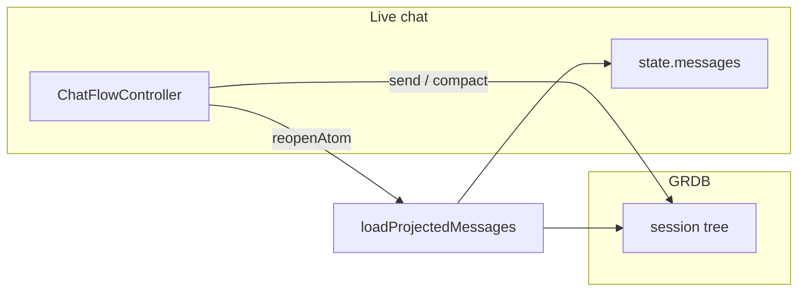

# OpenCore Context

| | |
| --- | --- |
| **Code** | `OpenCore/` |
| **Layout** | [docs/architecture/modules.md](../docs/architecture/modules.md) |
| **Map** | [CONTEXT-MAP.md](../CONTEXT-MAP.md) |

OpenCore is the iOS app shell. Implemented feature modules: **Onboarding**, **Home**, **Chat**, **SidePanel**, **Settings**, and **About**.

## Onboarding

- **Flow controller**: `OnboardingFlowController`
- **Persistence**: `OnboardingPersistenceClient` + `OnboardingProgressEntity` (SwiftData)
- **Screen**: single-page scene (`OnboardingView` → `OnboardingSinglePageView`) with a wireframe cube hero, "OPENCORE" wordmark, italic value-prop copy, and a swipe/tap pill CTA ("Swipe to Get Started")
- **Completion**: `AppRootView` routes to `HomeTabShellView` when `isFinished` is true
- **Motion**: `OnboardingCubeView` (isometric wireframe cube: vertex pop-in → edge line-reveal → dashed back edges → internal dust drift → idle float), per the `docs/animation-motion-replication.md` spec and the cube concept

## Home

- **Flow controller**: `HomeFlowController` (model catalog, selection, tab shell state)
- **Entry views**: `HomeTabShellView` (tabs), `HomeView` (chat/welcome tab)
- **Visual shell**: `HomeWelcomeView`, `HomeParticleOrbView`, `HomeComposerView`, `HomeModelPopupView`
- **Catalog**: `HomeModelCatalogClient` + `HomeModelCatalogCachePreferenceClient`
- **Composition**: wires `ChatView` + `SidePanelView`; switches welcome vs active chat
- **Context window (display)**: `ContextWindowEstimator`, `ContextWindowUsage`, `ContextTokenCounter`
- **Speed mode**: `HomeComposerSpeedMode` (standard vs fast provider routing)

## Vision

- **Flow controller**: `VisionFlowController` copies attachments into durable storage and extracts plain-text file content for model input
- **Composer wiring**: `HomeComposerView` plus-button attachment menu; indicators via `ChatComposerAttachmentsStripView`
- **Model input**: `ChatModelInputBuilder` sends file content, voice transcripts, and multimodal wire payloads

## Speech

- **Flow controller**: `SpeechFlowController` captures voice input, transcribes to the composer draft, and discards temporary recordings after transcription
- **Recognition**: `SpeechRecognitionClient` adapts `SpeechRecognitionStrategy` implementations (on-device `SFSpeechRecognizer`, remote Whisper via the active provider, or fallback composite) via a factory
- **Limits**: `SpeechRecordingLimits` auto-stops clips at 120 seconds, matching remodex-style voice guardrails
- **Patterns**: Strategy (recognition backends), Factory (`SpeechRecognitionStrategyFactory`), Adapter (`SpeechRecognitionClient`, `SpeechSystemRecognitionEngine`)

## Settings

- **Flow controller**: `SettingsFlowController` (provider + API key + compaction prefs)
- **Entry view**: `SettingsView` + `SettingsContextWindowSection`
- **Compaction**: `SettingsContextCompactionEngine`, `SettingsContextCompactionClient` (injected into Chat)
- **Docs**: [docs/contexts/settings/Settings-CONTEXT.md](../docs/contexts/settings/Settings-CONTEXT.md)

## About

- **Entry view**: `AboutView` (app metadata + GitHub link)

## Chat

- **Flow controller**: `ChatFlowController` (commands + async send/retry/stream + Pi-style compaction hook)
- **Attachments**: `ChatMessageAttachment` stores bubble media; `ChatModelInputBuilder` sends file paths and hidden speech transcripts to the model
- **Entry view**: `ChatView` (title, thread, error banner; composer stays in Home)
- **Streaming**: `ChatStreamingClient` + `ChatOpenAICompatibleStreamingClient`
- **Persistence**: `ChatHistoryClient` + GRDB append-only atom session entries (`PersistenceGRDBAtomHistoryStore`)
- **Compaction**: automatic (reserve headroom trigger), manual (composer button), overflow retry via `ChatContextOverflowDetector`
- **Resume**: `reopenAtom` loads projected messages (`loadProjectedChatMessages`) so compaction checkpoints survive atom resume; full history remains in the session tree
- **Views**: `ChatView`, `ChatThreadView`, `ChatMessageRowView`, `ChatReasoningCardView`, `ChatErrorBannerView`

Compaction detail and diagrams: [docs/contexts/settings/Settings-CONTEXT.md](../docs/contexts/settings/Settings-CONTEXT.md).

## SidePanel

- **Host controller**: `SidePanelFlowController`
- **Session scope**: `SidePanelSessionFlowController` (saved-conversation browser + sidebar)
- **Persistence**: `SidePanelHistoryClient` + `SidePanelConversationEntity` (SwiftData)
- **Presentation**: `SidePanelView` hosts session sidebar; `HomeView` toggles the drawer
- **Delegates**: `onOpenConversation`, `onActiveConversationRenamed`, `onActiveConversationDeleted`

Provider preferences and credentials are shared via `SidePanelProviderPreferenceStore` and `CredentialStoring` (used by Home, Chat, and Settings).
