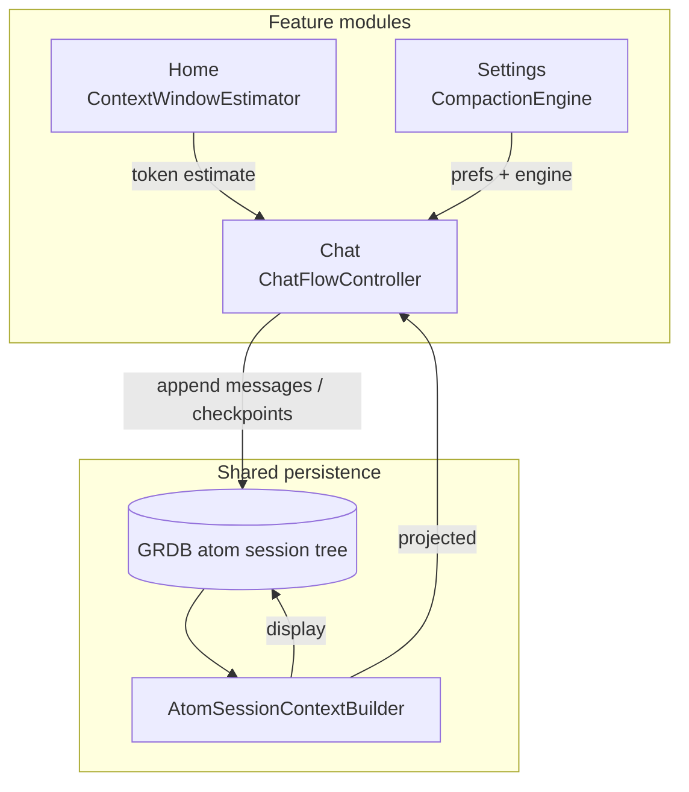

# Module Layout

OpenCore uses feature-oriented folders inside the app target. The folders are intentionally shaped like modules so they can be promoted to internal Swift Package or Xcode framework targets later without rewriting feature boundaries.

Onboarding flow state is owned by `OnboardingFlowController` and mutated through explicit commands — not TCA. The onboarding screen is a single page (no pager) built around a wireframe cube hero (`OnboardingCubeView`), the "OPENCORE" wordmark, italic value-prop copy, and a swipe/tap pill CTA ("Swipe to Get Started").

## Module map

```text
App
├── Shared        # Theme + UI primitives (cross-cutting)
├── Onboarding    # First-run product tour
├── SidePanel     # Conversation history browser (session scope)
├── Chat          # Live message stream, send/receive, active conversation
├── Settings      # Provider credentials, context compaction prefs
├── Speech        # On-device speech-to-text for composer input
├── Vision        # File/image/video to text for composer input
├── About         # App info tab
└── Home          # Welcome + composer + TabView shell
```

## Current layout

```text
OpenCore/
├── OpenCoreApp.swift         # @main entry point
├── App/                      # App shell
│   └── AppRootView.swift
├── Features/
│   ├── Onboarding/
│   │   ├── Core/
│   │   ├── Models/
│   │   ├── Views/
│   │   └── Utilities/
│   ├── Home/
│   │   ├── Core/
│   │   ├── Models/
│   │   ├── Utilities/
│   │   └── Views/            # HomeView, HomeTabShellView
│   ├── Chat/
│   │   ├── Core/
│   │   ├── Models/
│   │   ├── Views/
│   │   └── Utilities/
│   ├── Settings/
│   │   ├── Core/
│   │   ├── Models/
│   │   ├── Utilities/
│   │   └── Views/
│   ├── Speech/
│   │   ├── Core/
│   │   ├── Models/
│   │   ├── Views/
│   │   └── Utilities/
│   ├── Vision/
│   │   ├── Core/
│   │   ├── Models/
│   │   ├── Views/
│   │   └── Utilities/
│   ├── About/
│   │   └── Views/
│   └── SidePanel/
│       ├── Core/
│       ├── Models/
│       ├── Utilities/
│       ├── Session/
│       │   ├── Core/
│       │   └── Views/
│       └── Views/
└── Shared/
    ├── Theme/
    └── UI/
```

SidePanel is a self-contained internal module with a nested `Session/` scope for the history drawer. Settings and About are sibling top-level modules with flat role folders.

Home uses flat role folders only (`Core/`, `Models/`, `Utilities/`, `Views/`). Context window estimation lives in Home; compaction prefs and engine live in Settings.

Atom session persistence (`Shared/Persistence/Session/`, GRDB store) is append-only: message entries and compaction checkpoints form a tree. Chat resume and model sends use the projected context; the display view retains every message entry for auditing.



See [docs/contexts/settings/Settings-CONTEXT.md](../contexts/settings/Settings-CONTEXT.md) for compaction flow diagrams.

Local Swift packages live under `OpenCore/Packages/` (e.g. `ThinkingOrbsKit`).

## Role-based folders

Each feature organizes files by responsibility:

- `Core/` — flow controller, commands, flow state
- `Models/` — domain types and SwiftData entities
- `Views/` — SwiftUI screens and visual components
- `Utilities/` — persistence clients, visual builders

Folder names describe product roles, not design-pattern names.

## Access control

All types default to `internal`. Use `public` only when promoting a module to an internal framework or Swift Package boundary.
