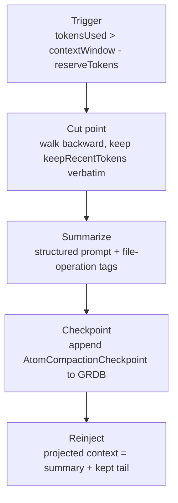
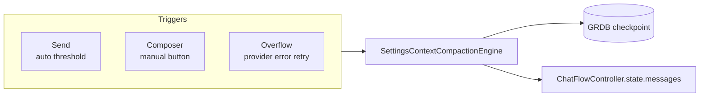
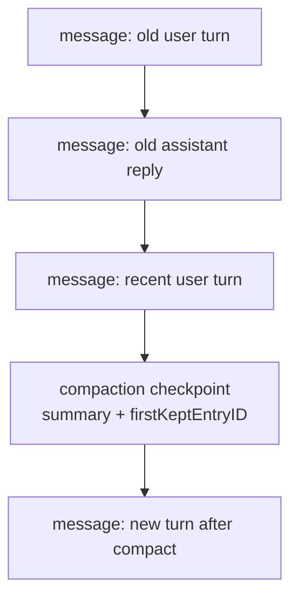
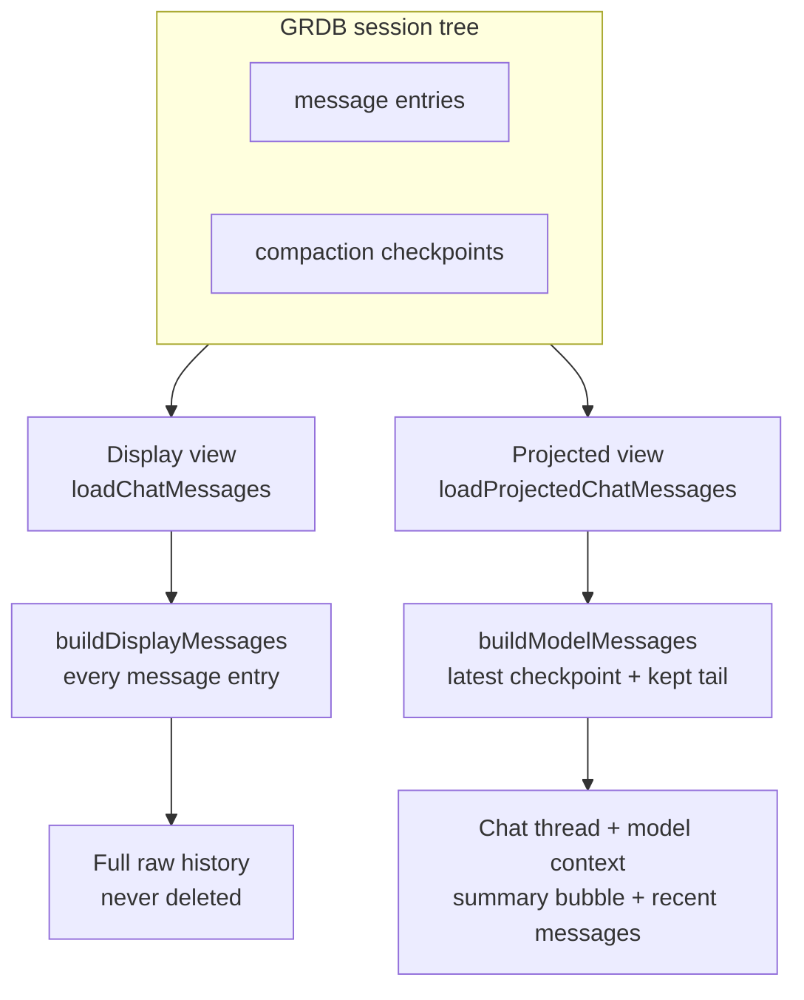
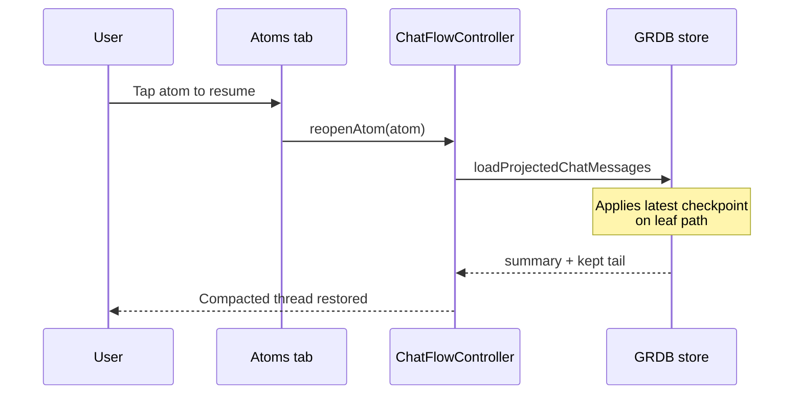
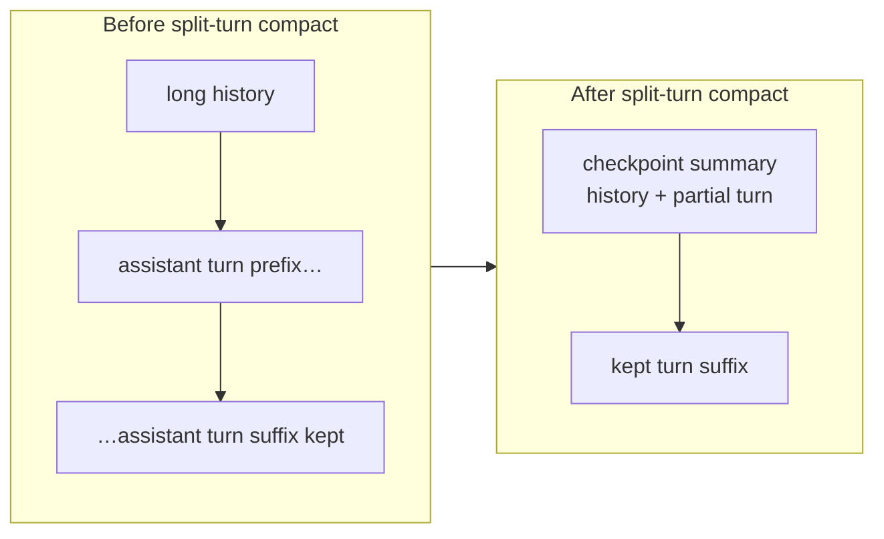

# Settings Context

| | |
| --- | --- |
| **Context** | App preferences + context compaction |
| **Code** | `OpenCore/Features/Settings/` (`Settings…` symbols) |
| **Map** | [CONTEXT-MAP.md](../../../CONTEXT-MAP.md) |
| **Layout rules** | [docs/architecture/modules.md](../../architecture/modules.md) |

Top-level feature module for provider credentials, model-related prefs (via shared `ProviderPreferenceStore`), and Pi-aligned context window compaction.

## Architecture

- State lives in `SettingsFlowController`; pure field updates use `SettingsCommand` via `SettingsCommandInvoker`.
- Persistence goes through `CredentialStoring`, `ProviderPreferenceStore`, and `SettingsContextCompactionPreferenceStore` — never direct UserDefaults/Keychain from views.
- Compaction uses Strategy pattern: `SettingsContextCompactionTrimStrategy`, orchestrated by `SettingsContextCompactionEngine`.
- `SettingsContextCompactionClient` is injected into `ChatFlowController` for send-time, manual, and overflow compaction.

## Context compaction (pi.dev aligned)

Compaction follows the pi.dev append-only session tree model:

1. **Trigger** — automatic compaction runs when `tokensUsed > contextWindow - reserveTokens` (default reserve: 16,384).
2. **Cut point** — walk backward from the leaf, keeping `keepRecentTokens` (default 20,000) verbatim.
3. **Summarize** — structured summary prompt with cumulative file-operation tags.
4. **Checkpoint** — append `AtomCompactionCheckpoint` to the GRDB session tree.
5. **Reinject** — projected model context becomes `summary + kept tail`.

Three paths invoke the same engine:

### Session tree

History is never deleted. Compaction appends a checkpoint node; older message entries remain in the tree.

### Storage vs. chat thread

Atom history uses two views of the same append-only session tree:

| View | API | Used for |
| --- | --- | --- |
| **Display** | `loadChatMessages` → `AtomSessionContextBuilder.buildDisplayMessages` | Raw message entries only; full history is never deleted |
| **Projected** | `loadProjectedChatMessages` → `AtomSessionContextBuilder.buildModelMessages` | Compaction-aware context: latest checkpoint summary + kept tail |

`ChatFlowController.reopenAtom` loads the **projected** view so resuming an atom shows the same compacted thread you had before leaving. Send-time compaction, manual compaction, and overflow recovery all persist checkpoints and update in-memory `state.messages` to the projected shape.

Synthetic summary bubbles (wrapped in `
` tags) exist only in the projected view; they are derived from checkpoint entries, not duplicated as message rows in GRDB.

### User controls (`SettingsContextWindowSection`)

| Setting | Default | Purpose |
| --- | --- | --- |
| Automatic compaction | on | Master switch for threshold-triggered compaction |
| Reserve response headroom | 16,384 tokens | Pi `reserveTokens` — space left for the model reply |
| Keep recent context | 20,000 tokens | Pi `keepRecentTokens` — recent history kept verbatim |

Manual compaction is available from the composer compact button. Overflow recovery compacts once and retries the failed turn when the provider reports a context-length error.

### Token counting

`ContextTokenCounter` warms up at launch and falls back to a character heuristic before load or on failure. `ContextWindowEstimator` and `AtomSessionCompactionPlanner` share this counter.

### Split-turn compaction

When a single assistant turn exceeds `keepRecentTokens`, compaction cuts mid-turn, summarizes both the prior history and the turn prefix, and merges them into one checkpoint summary (`## Current Turn (partial)`).

## Naming

All symbols use the `Settings` prefix — e.g. `SettingsView`, `SettingsFlowController`, `SettingsContextCompactionEngine`.
